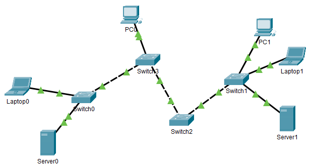
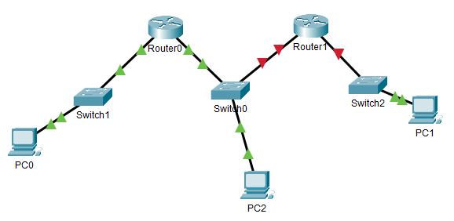

# Computernetwerken Studie-GPS
:toc-title: Inhoud
:toc:
:toclevels: 3
:figure-caption: Figuur

## Inleiding

### Doel
Deze studie-GPS heeft als doel:

- Een alternatieve volgorde aanbieden om de leerstof te     
  studeren/herhalen (andere volgorde dan Jeremy's IT Labs, andere     volgorde dan Cisco Netacad CCNA)
- Checklists om je te helpen nagaan of je klaar bent met een onderdeel
- Toelichten hoe gedetailleerd je een onderwerp moet kennen
- Extra aandacht geven aan foutopsporing
- Je aanmoedigen om soms bewust iets verkeerd te configureren en dan    
  na te gaan of het effectief misloopt waar jij het verwacht

### Indeling
Deze studie-GPS is ingedeeld in twee delen:

- Eerst leer je voldoende om de werking van een typisch thuisnetwerk    te begrijpen
- Daarna leer je netwerktechnologie die je meestal niet in een     thuisnetwerk tegenkomt, maar wel in het netwerk van een school of     
  een bedrijf
In deze cursus behandelen we geen draadloze netwerken. Hoewel draadloze netwerken overal voorkomen, blijft alles wat we leren relevant, ook voor netwerken met draadloze eindapparatuur.

### Methode
Deze studie-GPS geeft vooral een volgorde, en helpt jezelf te evalueren.
Je moet wel zelf actief op zoek gaan in het cursusmateriaal om elk
onderwerp goed te beheersen. Aan het einde van elke stap staat een
lijstje van verwachte kennis en vaardigheden die je zou moeten bereiken
in die stap.

### Oproep voor feedback
Deze studie-GPS is recent en nog in opbouw. Feedback over het nut ervan
is zeer welkom. Vind je deze alternatieve volgorde nuttig, of geef je
toch de voorkeur aan Netacad of Jeremy's IT Labs? Wat vind je er goed
aan? Wat vind je niet goed? Staan er fouten in? Ontbreekt er een stuk?
Feedback is welkom bij je coach voor Computer Networks.

### Tip
Bewaar al je packet tracer oefeningen, vooral de oefeningen waar je zelf
van een leeg blad begint te tekenen.

## Deel 1: Je netwerk thuis begrijpen

### Voorbereiding (packet tracer/wireshark)

. zorg dat je toegang hebt tot Cisco netacad (zie Toledo)
. installeer Cisco Packet Tracer op je computer (zie Toledo)
. installeer Wireshark op je computer (zie Toledo)

Zorg nu dat je in Packet Tracer een paar basisvaardigheden opdoet, als
eerste kennismaking. Wat hierbij kan helpen:

- Jeremy's "Packet Tracer Introduction | Day 1 Lab"
  (<https://www.youtube.com/watch?v=a1Im6GYaSno>)
- Netacad CCNA-1 submodule 2.3.7 Packet Tracer - Navigate the IOS
- experimenteer zelf wat, teken eens een netwerk vertrekkende van een
  leeg blad in packet tracer, kijk wat rond in packet tracer

Zorg daarna dat je in Wireshark een "capture" kan doen van het
netwerkverkeer op je computer:

- open wireshark, en selecteer de interface waarmee je op het internet
    geconnecteerd bent
- laat een aantal pakketten binnenkomen in Wireshark, en stop dan
    (rode stopknop)
- je klikt op een paar pakketten, en je kijkt alvast eens naar de
    informatie die je erin vindt; zie je ergens TCP (Tranmission Control
    Protocol) staan? zie je andere protocolnamen?

Als laatste zoek je uit hoe je het IPv4 adres van je computer kan
terugvinden via CLI, en je probeert dit uit. Hieronder alvast de
commando's die je waarschijnlijk nodig hebt:

- Windows: $ ipconfig
- Mac Terminal: $ ifconfig
- Linux terminal: $ ip address

Je bent klaar met deze stap wanneer je het volgende kent of kan:

. in packet tracer:
    - in een lege packet tracer een aantal switches, routers en PC's
        tekenen en verbinden (met automatische connectie-kabel), en ook
        terug verwijderen ; ook al begrijp je nog niet wat deze
        apparaten doen, je zou wel een gegeven topologie kunnen nabouwen
        in packet tracer (doe dit eventueel eens; neem een
        voorbeeldexamen en bouw het na)
    - "options/preferences" gebruiken om de labels van interfaces of
        apparaatnamen aan- en uit te zetten
    - bestanden (.pkt) opslaan, en terug openen
    - labo bestanden van Jeremy's IT Lab en Cisco Netacad openen
    - de CLI (command line interface) van een switch en router openen
        om toegang te krijgen tot IOS

. in Cisco IOS:

    - ken je een aantal verschillende modes, en herken je hun
        verschillende prompts (o.a. privileged exec mode, global config
        mode)
    - je begrijpt dat verschillende modes toegang geven tot
        verschillende commando's
    - je kent de CLI hulpmiddelen ? en TAB om mogelijk commando's te
        zien of aan te vullen
    - je kent al de commando's "enable", "configure terminal", en
        "exit" om tussen de modes te navigeren in IOS
    - je weet dat je commando's kunt afkorten als de afkorting
        eenduidig is (bvb. \# conf t), en je kan zo tikwerk besparen

. in wireshark:

    - je kan een dump maken van het netwerkverkeer op je
        computer/laptop
    - zie je de verschillende pakketjes (lijn per lijn), met een
        timestamp, en kan je de details van elk pakketje bekijken
    - je weet dat de informatie in de pakketjes digitaal wordt
        voorgesteld, dus ook de nuttige inhoud (video, document, \...)
        is digitaal
    - je kent de term "packet switched network", en hebt deze
        "packets" in wireshark gezien

. op je computer:
    - je weet dat er meestal meerdere netwerkinterfaces op je computer
        zijn
    - je begrijpt dat elke netwerkinterface zijn eigen IP adres heeft
        (of meerdere per interface)
    - zonder de details te begrijpen, weet je dat IPv6 een recentere
        variant is van het IP protocol dan IPv4, en dat momenteel heel
        veel netwerken beide versies tegelijk ondersteunen
    - je weet welke netwerk interface op jouw computer diegene is
        waarlangs je met het Internet communiceert
    - je weet via welk IPv4 adres je met het internet communiceert
    - je vindt ook het IPv6 adres terug van deze netwerkinterface (als
        je dat hebt)

### Eén IPv4 netwerk

Je bent klaar met deze stap wanneer je het volgende kent of kan:

Packet tracer bouwen/configureren:

- je kan in packet tracer een netwerk bouwen met switches, ethernet
    kabels, en "end devices" (PC / laptop / server) ; bijvoorbeeld zoals
    in de schermafbeelding hieronder, maar je kan dit voor eender welke
    combinatie van switches en eindapparaten
- je kan in zo'n netwerk het IPv4 adres configureren van alle end
    devices (bvb. adressen 192.168.10.1, 192.168.10.2, \... met masker
    255.255.255.0)
- je herkent de prefixen Eth/Fa/Gi voor benamingen van interfaces in
    Cisco apparatuur, en kent hun maximale bitrates
- je weet dat er straight-through en crossover kabels bestaan, ook in
    packet tracer simulatie; je weet dat dit in moderne apparatuur
    automatisch wordt gedetecteerd en geen belangrijke rol meer speelt
    in de praktijk
- je weet misschien nog niet hoe een switch juist werkt, maar je merkt
    al dat je een switch niet hoeft te configureren om hem in je netwerk
    te laten werken
- je kan in een switch CLI de interface status bekijken (connected of
    niet); hangt er een kabel aan een interface of niet?
- je kan in een switch CLI een interface in shutdown zetten, en terug
    aanzetten
- je kan in een switch CLI met een interface range ineens meerdere
    interfaces in shutdown zetten

Packet tracer ping:

- je kan vanop elk type eindapparaat (laptop, computer, server) een
    ping verzenden via de computer CLI (hint: Desktop / Command prompt)
- je kan aantonen of end devices elkaar al dan niet kunnen **pingen**
    ; dus je herkent een geslaagde ping versus een gefaalde ping
- je hebt al eens bewust een switch interface in shutdown gezet, en
    dan gezien dat het apparaat achter die interface niet meer
    bereikbaar is
- je hebt al eens bewust een ping laten falen door een eindapparaat
    met een compleet ander IPv4 adres te configureren (bvb. 10.10.10.10
    met mask 255.255.0.0 terwijl alle andere apparaten 192.168.10.x als
    IP adres hebben)
- je begrijpt dat een IPv4 adres uniek moet zijn binnen het netwerk,
    dus als er twee eindapparaten hetzelfde IPv4 adres hebben, dan gaat
    het ergens mis (probeer dit gerust eens; wat gebeurt er? misschien
    begrijpt je verder in de cursus pas wat er exact misloopt\...)

Kennis:

- je (her)kent een UTP Ethernet kabel (copper in Packet Tracer)
- je weet dat Ethernet gestandaardiseerd is (en dus kabels en
    apparaten van verschillende merken moeten samenwerken), je kent de
    typische bitrates voor Ethernet
- je begrijpt de begrippen half duplex/full duplex
- je weet dat ethernet autonegotiatie bestaat voor speed/duplex
- je weet dat er ook glasvezelkabels bestaan, eveneens binnen de
    Ethernet standaard(en)
- je weet dat vanaf een bepaalde lengte van een kabel, de verbinding
    niet goed meer werkt, dus dat het juiste type kabel gekozen moet
    worden afhankelijk van de toepassing
- je weet dat computernetwerken werken met data pakketjes: per keer
    wordt een bepaalde hoeveelheid informatie doorgestuurd, in kleine
    pakketjes
- je weet in grote lijnen hoe een IPv4 adres eruit ziet, en dat daar
    voor een end device ook een netwerkmasker (Engels "subnet mask") bij
    hoort

Eigen computer:

- je kan met je eigen computer pingen naar een apparaat op het
    internet aan de hand van het IP adres (bvb. ping 8.8.8.8)
- je kan met je eigen computer pingen naar een server op basis van de
    naam in plaats van het IP adres (bvb. ping www.ucll.be) ; zie je dat deze naam wordt
    omgezet in een IP adres? is het een IPv4 adres of ziet het er
    helemaal anders uit, en is het misschien eerder een IPv6 adres?

Wat je niet moet kennen/kunnen voor deze stap:

- het manueel instellen van speed/duplex op ethernet interfaces van
    netwerkapparaten (gewoon weten dat het kan/bestaat, maar automatisch
    gebeurt in moderne apparaten)

.Voorbeeldnetwerk om in deze stap te bouwen 

### IPv4 adressen

Je bent klaar met deze stap wanneer je het volgende kent of kan:

Talstelsels:

- je kent binaire/decimale/hexadecimale voorstellingen van getallen,
    en kan omzettingen doen ; dat mag met een rekenmachine, maar je hebt
    ook het inzicht om dat desnoods met de hand te kunnen
- je kan een logisch EN ("and") berekenen op binaire getallen, een ook
    op decimale en hexadecimale getallen; dat mag met een rekenmachine,
    maar je hebt ook het inzicht om dat desnoods met de hand te kunnen

IPv4 adressen, basis

- je kent/herkent een geldig IPv4 adres in de "dotted decimal"
    notatie, je weet dat het 32 bits lang is, dat er dus 8 bits zijn per
    decimaal getal
- je weet dat een IPv4 adres een netwerkdeel en een hostdeel heeft
- je kent volgende twee manieren om het netwerkdeel van een IPv4 adres
    aan te geven: netwerkmasker notatie (bvb. 255.0.0.0), en de "slash"
    notatie (bvb. /8)
- je kan een netwerkmasker converteren in een slash notatie en
    omgekeerd
- je begrijpt dat er twee speciale adressen zijn, niet geschikt voor
    het adres van een host: IPv4 **broadcastadres** en IPv4
    **netwerkadres**, en je kan beide adressen afleiden uit een gegeven
    hostadres; je kent goed het onderscheid tussen een **hostadres** en
    een netwerkadres
- je kent de betekenis van een "broadcast"
- je kan nagaan of twee IPv4 adressen (met gegeven netwerkmasker) in
    hetzelfde netwerk zitten of niet
- je kan voor een gegeven IPv4 netwerk uitrekenen hoeveel geldige host
    adressen erin zitten (en je kan ze desnoods allemaal oplijsten)
- je kan zelf meerdere IPv4 netwerken bedenken die geen overlap hebben

IPv4 adressen, types

- je kent/herkent het verschil tussen publieke en "private" IPv4
    adressen, je herkent 192.168.x.y als private, en ook 10.x.y.z ; je
    weet dat er nog andere private ranges of speciale adressen bestaan,
    en kan ze opzoeken
- je weet dat op het Internet private adressen niet gebruikt worden
    (alleen publieke adressen), en dat private adressen ook niet
    gerouteerd worden op het Internet
- je weet dat in bedrijven of thuisnetwerken meestal private
    IPv4-adressen gebruikt worden (ook al begrijp je misschien nog niet
    hoe apparaten met een private adres, zoals jouw eigen PC, kunnen
    communiceren met apparaten op het Internet; dat komt nog)
- je weet dat er behalve IPv4 unicast en broadcast, ook nog multicast
    bestaat, en snapt in grote lijnen waarvoor dit dient

Packet tracer:

- je kan in packet tracer aantonen dat een PC met IPv4 192.168.10.1/24
    en een PC met IPv4 192.168.11.1/24 niet met elkaar kunnen
    communiceren als er alleen switches en kabels gebruikt worden; en je
    snapt dat dit is omdat ze niet in hetzelfde IPv4 netwerk zitten

Eigen computer:

- je kan het IPv4 adres van je eigen laptop vinden
- je kan het IPv4 adres van een http(s) server op het internet vinden

### Twee IPv4 netwerken / één router

Vorige stap: we lieten eindapparaten met elkaar communiceren via IPv4,
maar dat werkte alleen als deze apparaten in hetzelfde IPv4 netwerk
zaten. In deze stap zien we hoe apparaten in verschillende IPv4
netwerken met elkaar kunnen communiceren door een router toe te voegen.

Je bent klaar met deze stap wanneer je het volgende kent of kan:

Packet tracer:

- je kan twee netwerken zoals gezien/geoefend in de vorige stap aan
    elkaar koppelen met 1 router
- je kan een IPv4 (host)adres toekennen aan een router interface
- je ondervindt dat router interfaces zonder configuratie in shutdown
    staan, en je ze dus expliciet moet aanzetten (in tegenstelling tot
    switch interfaces)
- je begrijpt dat de **default gateway** instelling in een
    eindapparaat nodig is vooraleer die buiten zijn eigen netwerk
    (m.a.w. voorbij de router) kan communiceren
- je kan nu twee willekeurige netwerken met 1 router ertussen
    configureren zodanig dat alle apparaten elkaar kunnen pingen (router
    configureren en eindapparaten configureren)
- je begrijpt dat je de router interface een willekeurig IPv4 adres in
    je netwerk kan geven, zolang die maar overeenkomt met de default
    gateway instellingen
- je begrijpt dat routers net als eindapparaten gebruik maken van
    hostadressen (dus geen netwerkadres of zo)
- je kan de IP configuratie van de interfaces van een Cisco router
    opvragen via de CLI
- je kan packet tracer configuraties met 1 router en meerdere IPv4
    netwerken troubleshooten
- je kan via IOS CLI de **routing tabel** van een Cisco router laten
    zien
- je hebt eens geprobeerd om twee interfaces van een router een IP
    adres te geven binnen hetzelfde netwerk, en je ziet dat Cisco IOS
    dit niet aanvaardt
- je kan foutopsporing doen in configuraties met 1 router (PC
    configuratie, router interface configuratie)

Kennis:

- je weet dat een router verschillende netwerken verbindt met elkaar
- je weet dat een router interface -- net als een PC of een server --
    een IP adres heeft
- je weet dat de netwerken van de eigen interfaces automatisch in de
    routing tabel worden toegevoegd, je hoeft deze routes niet zelf in
    de routing tabel toe te voegen
- je begrijpt dat wij zelf moeten zorgen dat alle router interfaces en
    eindapparaten achter deze router interface een IPv4 adres hebben dat
    binnen hetzelfde netwerk ligt, en de router zelf de scheiding is
    tussen verschillende netwerken

Wat we nog niet kunnen nu:

- je probeert ook eens drie netwerken aan elkaar te koppelen met 2
    routers, zoals in onderstaande figuur; de PC's aan de uiteinden
    kunnen niet zomaar met elkaar communiceren; weet je waarom niet?
    misschien vind je het antwoord als je goed kijkt naar de routing
    tabellen; we gaan dit leren in de volgende stap
- misschien vroeg je je af: hoe kan een PC een pakket sturen naar een
    default gateway, met name een router in het eigen netwerk, terwijl
    de bestemming (destination IP) in de ping toch dat van de finale
    bestemming is? Dit gaan we later zien.

.Drie netwerken, twee routers: werkt (nog) niet na deze stap

### Drie (of meer) IPv4 netwerken / statische routering

### OSI model intro (L1-L3)

### ARP en ICMP, PT simulatie

### Ethernet switching / life of a packet

### IPv4 subnetting

### IPv6

### OSI vervolg, TCP/UDP, client-server, DNS/...

### IPv4 dynamische adressering (DHCP)

### IPv6 dynamische adressering

### NAT (IPv4)

### je eigen thuisnetwerk begrijpen

## Deel 2: technologieën in een bedrijfsnetwerk

### SVI en loopback

### paswoorden / SSH

### VLAN's

### multi-layer switches (MLS)

### OSPF (v2)

### STP

### Linkaggregatie (Etherchannel)

### Access control lists
